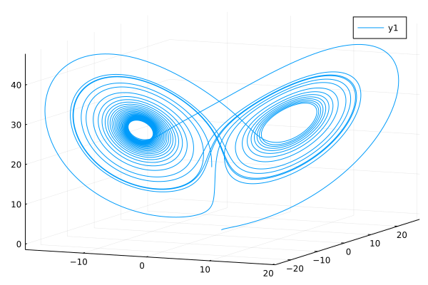
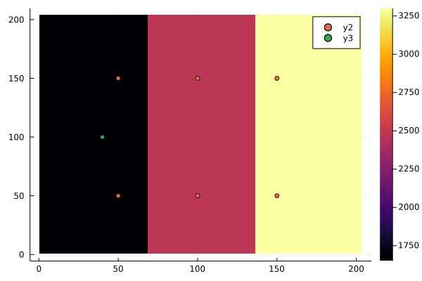
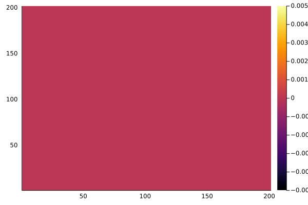
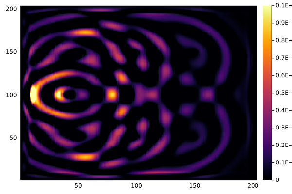

# Automatic Differentiation in Physics Simulation (自动微分以及它在物理模拟中的应用)

This is a repo for demonstrating the examples in paper "自动微分以及它在物理模拟中的应用".
## Get started
1. Install packages

```julia-pkg
pkg> add https://github.com/JuliaReverse/ReversibleSeismic.jl#master

pkg> dev https://github.com/GiggleLiu/WuLiXueBao
```

2. Run a demo

## The easy one: Lorenz curve
```julia
julia> using TreeverseAndBennett, TreeverseAndBennett.Lorenz, Plots

julia> y0 = P3(1.0, 0.0, 0.0)

julia> θ=(10.0, 27.0, 8/3)
(10.0, 27.0, 2.6666666666666665)

julia> curve = i_ODESolve(RK4(), i_lorenz, zeros(P3{Float64}, 10001), y0, θ; ts=0.0:3e-3:30)[3]
```




## The hard one: Seismic simulation

Generate a target landscape, wave source and detector locations

```julia
julia> using ReversibleSeismic, TreeverseAndBennett.Seismic, Plots

julia> nx = ny = 201

julia> nstep = 1000

julia> src = (nx÷2, ny÷5)

julia> rc = Ricker(param, 30.0, 200.0, 1e6)  # source

julia> param = AcousticPropagatorParams(nx=nx, ny=ny, 
        nstep=nstep, dt=0.1/nstep,  dx=200/(nx-1), dy=200/(nx-1),
        Rcoef = 1e-8)

julia> c2 = three_layers(nx, ny)

julia> detector_locs = CartesianIndex.([(50, 50), (50, 100), (50, 150), (150, 50), (150, 100), (150, 150)])
```

The landscape, detector locations (yellow) and source location (src) are look like



One can simulate the wave propagation and visualize it
```julia
julia> solve(param, src, rc, c2)
```



Compute the pulses that received by the detector
```julia
julia> target_pulses = solve_detector(param, src, rc, c2, detector_locs)
```


Now, we compute the gradient on the initial uniform landscape.

```julia
julia> c20 = 3300^2*ones(nx+2,ny+2)

julia> loss, (gin, gsrcv, gc), log = getgrad_mse(c2=c20, param=param, src=src, srcv=rc,
                    target_pulses=target_pulses, detector_locs=detector_locs,
                    method=:treeverse, treeverse_δ=20, usecuda=false)
```



Here, the method for time space tradeoff is Treeverse algorithm (δ=20).