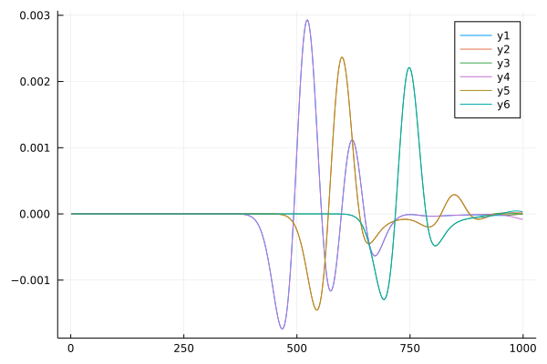

# Automatic Differentiation in Physics Simulation (自动微分以及它在物理模拟中的应用)

This is a repo for demonstrating the examples in paper "自动微分以及它在物理模拟中的应用".

## Examples
### Get started
To install related packages, please open [Julia](https://julialang.org/)'s interactive session (known as REPL) and press `]` key in the REPL to use the package mode, then type the following command

```julia-pkg
pkg> add ForwardDiff NiLang Plots

pkg> add https://github.com/JuliaReverse/ReversibleSeismic.jl#master

pkg> dev https://github.com/GiggleLiu/WuLiXueBao
```

The `dev` command will clone the repo to the `~/.julia/dev` folder.

### The easy one: Lorenz curve
Open a Julia REPL and type

```julia
julia> using TreeverseAndBennett, TreeverseAndBennett.Lorenz, Plots

julia> y0 = P3(1.0, 0.0, 0.0)

julia> θ = (10.0, 27.0, 8/3)
(10.0, 27.0, 2.6666666666666665)

julia> Δt, Nt = 3e-3, 10000

julia> curve = i_ODESolve(RK4(), i_lorenz, zeros(P3{Float64}, Nt+1), y0,
         θ; ts=0.0:Δt:Nt*Δt)[3]
```
`i_ODESolve` is the reversible implementation of ODE solver, `P3` is the axes of a 3D vector.


Let the `x` axis of the final position be the loss, we can compute gradients with different methods

ForwardDiff
```julia
julia> using ForwardDiff

julia> ForwardDiff.gradient(x->ODESolve(RK4(), lorenz, P3(x[1:3]...),
        (x[4:6]...,); ts=ts=0.0:Δt:Nt*Δt).x, [y0.x, y0.y, y0.z, θ...])
6-element Vector{Float64}:
    1807.1468707714816
     669.36087230128
  787697.5574499699
 -297541.66270377295
  176517.9204222756
       1.301738888866972e6
```

NiLang
```julia
julia> using NiLang

julia> @i function iloss!(out, f, history, y0, θ; ts)
        i_ODESolve(RK4(), (@const f), history, y0, θ; ts=ts)
        out += history[end].x
    end

julia> NiLang.AD.gradient(iloss!, (0.0, i_lorenz, zeros(typeof(y0), Nt+1), y0,
         θ); ts=0.0:Δt:Δt*Nt, iloss=1)[[4,5]]
(P3{Float64}(1807.1468707666784, 669.3608723060656, 787697.557449949),
 (-297541.66270376625, 176517.92042226513, 1.3017388888669878e6))
```

Neural ODE + NiLang
```julia
julia> gn = P3(1.0, 0.0, 0.0);

julia> gθ = Glued(1.0, 0.0, 0.0);

julia> g1, gθ = checkpointed_neuralode(RK4(), lorenz, lorenz_aug_dynamics,
             y0, gn, θ, gθ; ts=0:Δt:Nt*Δt, checkpoint_step=200)
(P3{Float64}(1810.08292, 675.35480, 787701.51393), 
  Glued{Tuple{Float64, Float64, Float64}}((-297536.82990, 176532.04322, 1.30181)))
```

Every 200 steps, we restore the state from the checkpoint, one can still see errors due to the irreversibility of the RK4 integrator.


### The hard one: Seismic simulation

Generate a target landscape, wave source and detector locations

```julia
julia> using ReversibleSeismic, TreeverseAndBennett.Seismic, Plots

julia> nx = ny = 201

julia> nstep = 1000

julia> src = (nx÷2, ny÷5)

julia> param = AcousticPropagatorParams(nx=nx, ny=ny, 
        nstep=nstep, dt=0.1/nstep,  dx=200/(nx-1), dy=200/(nx-1),
        Rcoef = 1e-8)

julia> rc = Ricker(param, 30.0, 200.0, 1e6)  # source

julia> c2 = three_layers(nx, ny)

julia> detector_locs = CartesianIndex.([(50, 50), (50, 100), (50, 150),
         (150, 50), (150, 100), (150, 150)])
```

The landscape, detector locations (yellow) and source location (src) are look like


One can simulate the wave propagation and visualize it
```julia
julia> solve(param, src, rc, c2)
```


Compute the pulses that received by the detector
```julia
julia> target_pulses = solve_detector(param, src, rc, c2, detector_locs)
```



Now, we compute the gradient on the initial uniform landscape.

```julia
julia> c20 = 3300^2*ones(nx+2,ny+2)

julia> loss, (gin, gsrcv, gc), log = getgrad_mse(c2=c20, param=param, src=src,
            srcv=rc, target_pulses=target_pulses, detector_locs=detector_locs,
            method=:treeverse, treeverse_δ=20, usecuda=false)

julia> loss2, (gin2, gsrcv2, gc2), log2 = getgrad_mse(c2=c20, param=param, src=src,
            srcv=rc, target_pulses=target_pulses, detector_locs=detector_locs,
            method=:bennett, bennett_k=20, usecuda=false)
```


Here, the method for time space tradeoff is Treeverse algorithm (δ=20) and Bennett algorithm (k=20).